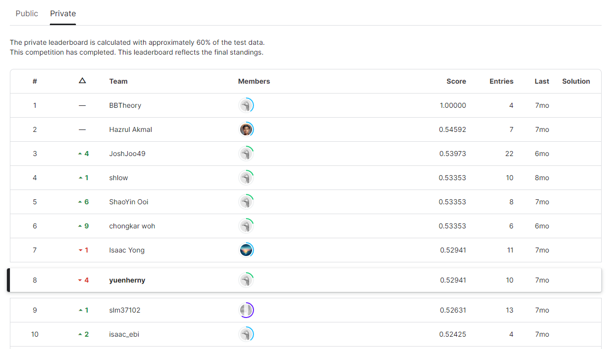

# Malaysia ML Study Jam Mini Hackathon
Malaysia ML Study Jam Mini Hackathon is organised for all Malaysia ML Study Jam Participants. 
The duration of this hackathon is from 13th August till 30th September 2022.

In this competition, you are given a Market Segmentation dataset with some missing values. 
You are required to build model to predict Customer Segments class.
Evaluation is based on mean F-score. This leaderboard is calculated with approximately 40% of the test data. 
The final results will be based on the other 60%, so the final standings may be different. 
The final winners will be determined by combining both public (40%) and private (60%) results.

## Dataset
A telco company is planning to introduce several new products to their existing customers.
Based on the market research conducted by their marketing department,
the result is promising and these new products can be marketed according to different customer segments.

In their market research, the marketing department has classified all customers into 4 segments (Class 1, Class 2, Class 3 and Class 4).
Marketing campaigns were performed to these customer segments and the ROI is good. 
The same marketing campaigns will be used on the new potential 1614 customers.

You are required to use Machine Learning models to predict the right segments of the new customers.

## Leaderboard Result
See full leaderboard at [Kaggle](https://www.kaggle.com/competitions/malaysia-study-jam-mini-hackathon/leaderboard?).

